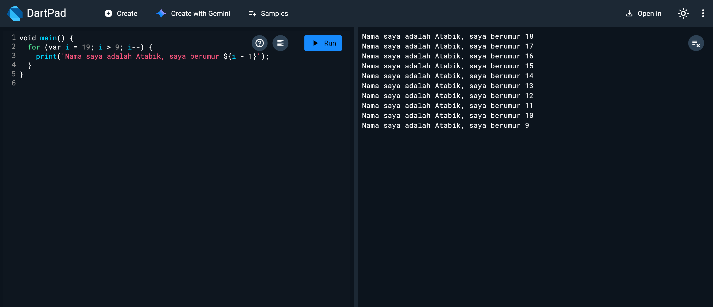
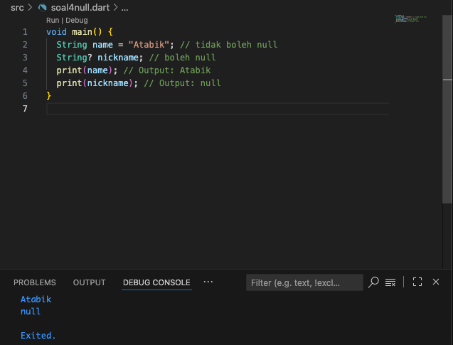
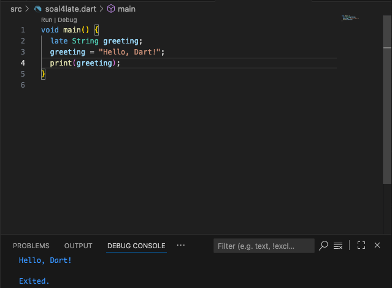

# MobileDev
# Codelab Dart
## Soal 1
- Modifikasilah kode pada baris 3 di VS Code atau Editor Code favorit Anda berikut ini agar mendapatkan keluaran (output) sesuai yang diminta!

## Soal 2
### Mengapa sangat penting untuk memahami bahasa pemrograman Dart sebelum kita menggunakan framework Flutter?
- Flutter dibangun sepenuhnya menggunakan **Dart**, sehingga seluruh logika aplikasi, widget, dan state management ditulis dengan Dart.  
- Pemahaman Dart mempermudah developer untuk:
  - Menguasai **fundamental programming** (variabel, fungsi, class, OOP, dll).  
  - Memanfaatkan fitur khusus Dart seperti **null safety**.  
  - Membuat kode lebih **efisien, aman, dan mudah dikelola**.  
- Intinya, menguasai Dart = pondasi kuat sebelum melangkah ke Flutter.

---

## Soal 3
### Rangkumlah materi dari codelab ini menjadi poin-poin penting
- **Dasar Sintaks Dart** → variabel, tipe data, operator, kontrol alur (if, for, while).  
- **Fungsi (Function)** → reusable code untuk mengurangi duplikasi.  
- **Object Oriented Programming (OOP)** → class, objek, inheritance, composition, encapsulation, polymorphism.  
- **Collection** → list, map, set untuk mengelola data.  
- **Null Safety** → mengurangi error `null` dengan sistem aman.  
- **Late Modifier** → menunda inisialisasi variabel hingga diperlukan.  


## Soal 4
### Perbedaan Null Safety dan Late Variabel
- **Null Safety**  
  - Fitur Dart untuk mencegah error `null`.  
  - Variabel harus didefinisikan dengan nilai **non-null** atau ditandai dengan `?` jika boleh null.  
  - **Contoh:**
    ```dart
    void main() {
      String name = "Atabik";       // tidak boleh null
      String? nickname;             // boleh null
      print(name);                  // Output: Atabik
      print(nickname);              // Output: null
    }
    ```
    

- **Late Variabel**  
  - Digunakan untuk menunda inisialisasi variabel hingga nanti saat dipakai.  
  - Cocok untuk variabel yang nilainya baru tersedia belakangan.  
  - **Contoh:**
    ```dart
    void main() {
      late String greeting;
      greeting = "Hello, Dart!";
      print(greeting); // Output: Hello, Dart!
    }
    ```
    
    
**Kesimpulan:**  
- `null safety` menjaga agar variabel tidak sembarangan null.  
- `late` menunda inisialisasi variabel hingga memang dibutuhkan.
