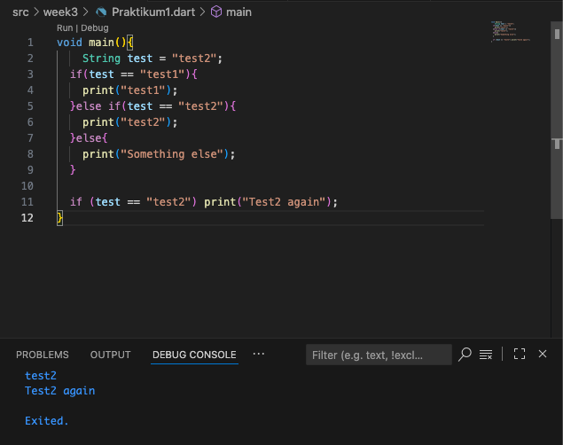
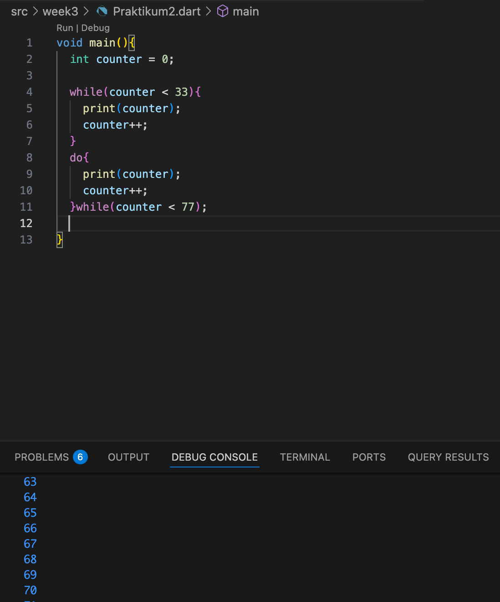
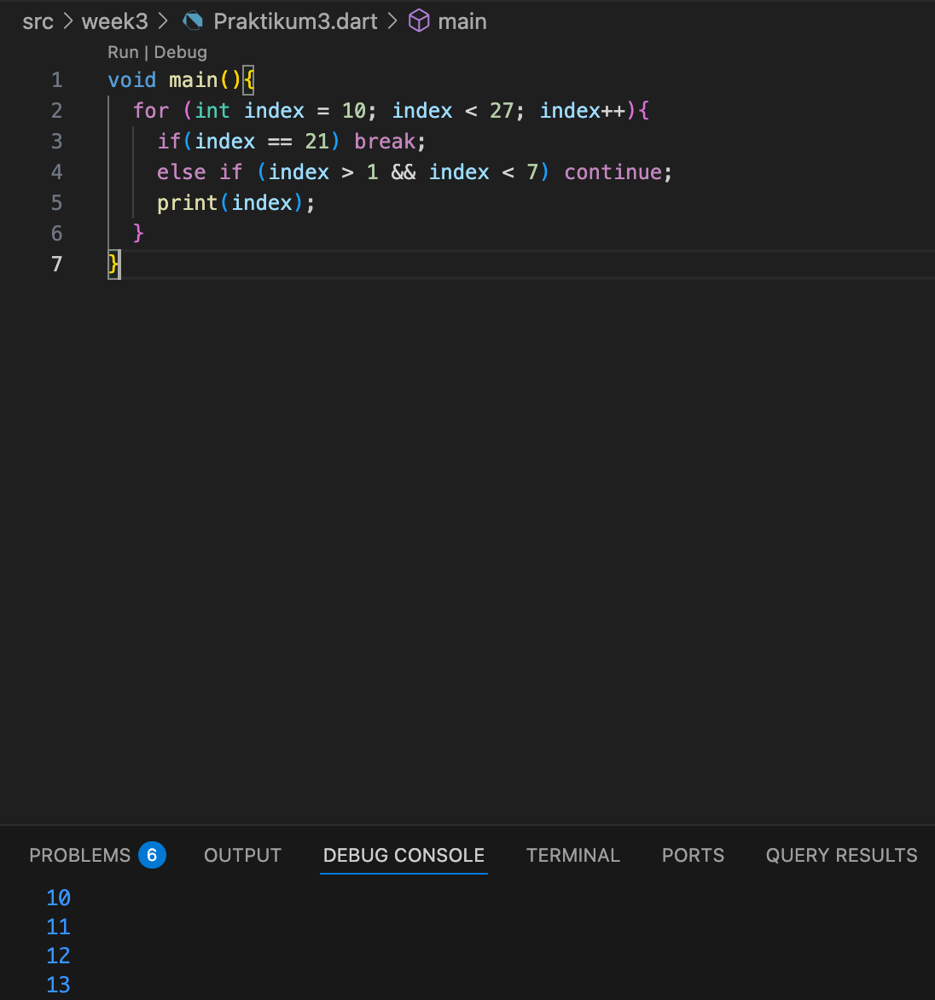
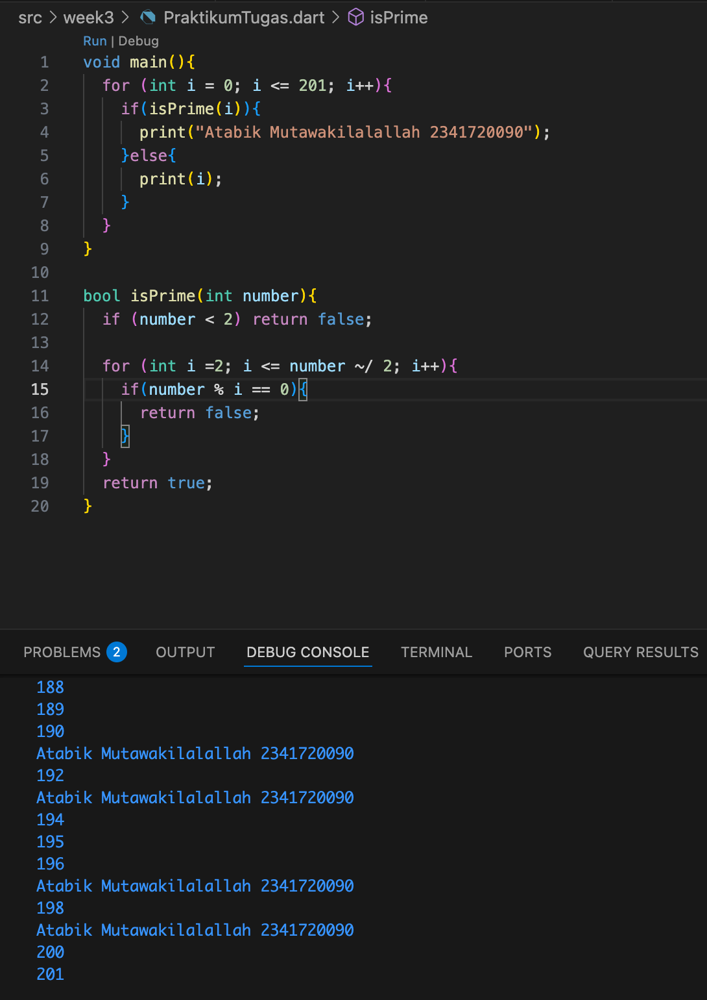

# Week2
## Praktikum 1
Praktikum 1: Menerapkan Control Flows ("if/else")

## Praktikum 2 
Menerapkan Perulangan "while" dan "do-while"

## Praktikum 3
Menerapkan Perulangan "for" dan "break-continue"

## Tugas Praktikum
Buatlah sebuah program yang dapat menampilkan bilangan prima dari angka 0 sampai 201 menggunakan Dart. Ketika bilangan prima ditemukan, maka tampilkan nama lengkap dan NIM Anda.

