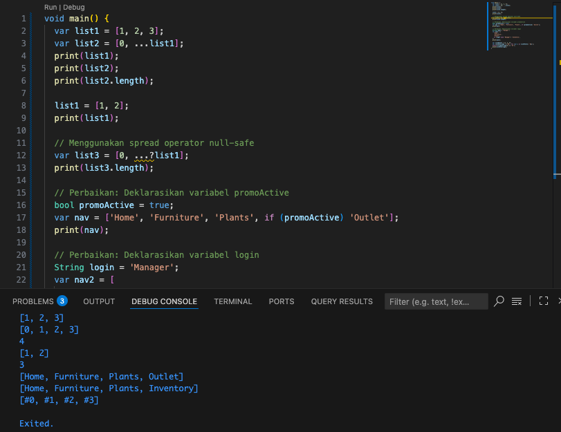

# Week2
## Praktikum 1
Praktikum 1: Eksperimen Tipe Data List

Ubah kode pada langkah 1 menjadi variabel final yang mempunyai index = 5 dengan default value = null. Isilah nama dan NIM Anda pada elemen index ke-1 dan ke-2. Lalu print dan capture hasilnya.

Apa yang terjadi ? Jika terjadi error, silakan perbaiki.

## Praktikum 2
Praktikum 2: Eksperimen Tipe Data Set

## Praktikum 3
Praktikum 3: Eksperimen Tipe Data Maps

Tambahkan elemen nama dan NIM Anda pada tiap variabel di atas (gifts, nobleGases, mhs1, dan mhs2). Dokumentasikan hasilnya dan buat laporannya!

## Praktikum 4
Praktikum 4: Eksperimen Tipe Data List: Spread dan Control-flow Operators

## Praktikum 5
Praktikum 5: Eksperimen Tipe Data Records

## Tugas Praktikum
Dokumen ini merangkum lima konsep kunci terkait fungsi dalam bahasa pemrograman Dart, lengkap dengan penjelasan dan contoh sintaks.

1. Jelaskan yang dimaksud Functions dalam bahasa Dart!

blok kode yang diberi nama untuk melakukan tugas tertentu. Fungsi ini bisa dipanggil dan digunakan berulang kali di berbagai bagian program.

2. Jenis-jenis Parameter di Functions
Dart menyediakan beberapa jenis parameter untuk membuat fungsi yang fleksibel dan mudah dibaca.

Required Positional: Parameter standar yang wajib diisi sesuai urutannya.

Optional Positional: Parameter tidak wajib yang ditandai dengan kurung siku []. Harus nullable atau memiliki nilai default.

Optional Named: Parameter tidak wajib yang dipanggil berdasarkan namanya, ditandai dengan kurung kurawal {}.

Required Named: Parameter wajib yang dipanggil berdasarkan namanya, menggunakan kata kunci required di dalam {}.

3. Functions sebagai First-Class Objects
Konsep ini berarti fungsi diperlakukan sama seperti objek lain (misalnya String atau int). Artinya, sebuah fungsi dapat:

Disimpan dalam sebuah variabel.

Dijadikan argumen untuk fungsi lain.

Dijadikan nilai kembali (return value) dari fungsi lain.

4. Anonymous Functions (Fungsi Anonim)

Fungsi anonim adalah fungsi yang tidak memiliki nama. Sering disebut juga lambda, fungsi ini sangat berguna untuk operasi singkat yang hanya dipakai sekali, terutama saat dijadikan argumen untuk fungsi lain.

5. Perbedaan Lexical Scope dan Lexical Closures
Kedua konsep ini sangat berkaitan dalam menjelaskan bagaimana fungsi mengakses variabel.

Lexical Scope: Ini adalah aturan di mana lingkup (aksesibilitas) sebuah variabel ditentukan oleh lokasinya di dalam kode sumber. Sebuah fungsi dapat mengakses variabelnya sendiri dan variabel dari lingkup induknya.

Lexical Closure: Ini adalah sebuah fungsi yang "mengingat" variabel dari lingkup tempat ia dibuat, bahkan setelah lingkup induknya tersebut selesai dieksekusi. Closure adalah fungsi ditambah dengan "memori" lingkungannya.

6. Return Multiple Values di Functions
Secara teknis, fungsi di Dart hanya mengembalikan satu objek. Untuk mengembalikan beberapa nilai, kita harus membungkusnya dalam satu objek. Cara terbaik dan paling modern (sejak Dart 3) adalah menggunakan Record.

Record adalah tipe data anonim yang dapat menggabungkan beberapa nilai menjadi satu objek tunggal secara efisien dan aman-tipe (type-safe).

